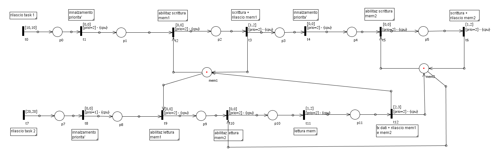
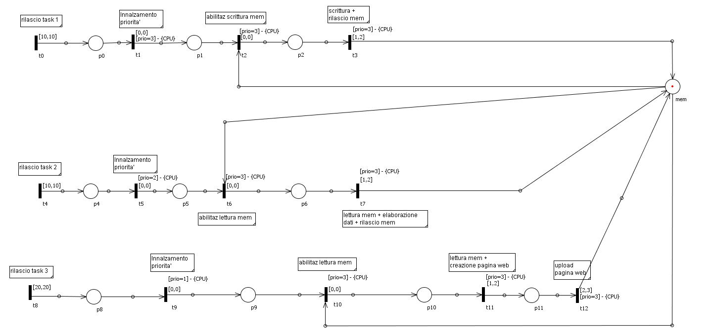
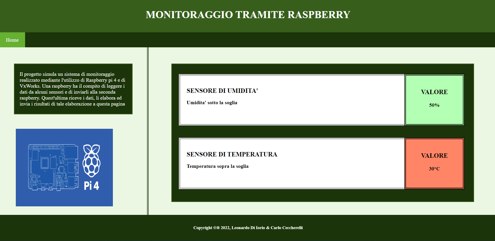

# Communication system between two Raspberry Pi using VxWorks

## Brief description
This project was developed during the first year of the master degree in Computer Science Engineering together with Leonardo Di Iorio for the exam in Software Engineering for Embedded Systems.

The aim of the project was to develop a system permitting the exchange of data between two Raspberry Pi 4B:

* we used the Oris tool (available [here](https://stlab.dinfo.unifi.it/oris1.0/)) to model and test the system using Preemptive Time Petri Nets (PTPN).
* we implemented the relative dkm (downloadable kernel modules) on the real time operating system VxWorks.
* we implemented a busy sleep function called *resourceBusy()* to test and simulate the execution of the applications.
* we instrumented the code generating relative timestamps with respect to the transitions of the Petri nets.
* we validated the system importing on Oris the log files generated by the instrumentation (**log_app1.txt** and **log_app2.txt**) and using the PetriSimulator plugin (which requires also the files **task_set_def_app1.txt** and **task_set_def_app2.txt**).

The system consists of two applications running on the two rpi:

* the first app has the role of UDP Client and simulate the reading of values from two sensors, sending the data to the second app.
* the second app has the role of UDP Server, it checks if the data received exceed some thresholds and hosts a web page in which is possible to visualize the elaborated results.

## Petri nets and HTML page
Here you can see the models of the two applications and the web page hosted by the second rpi.

**App1**

**App2**

**Web page**

